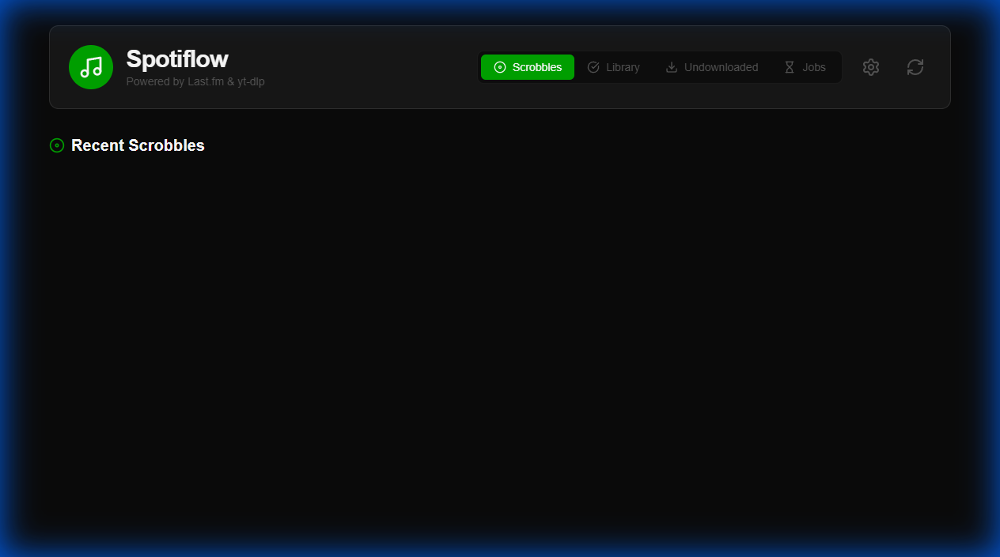
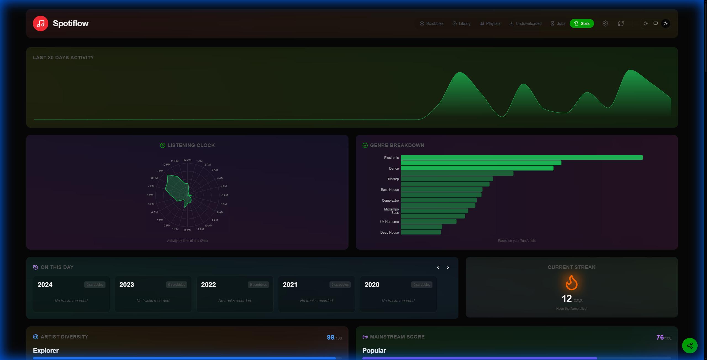
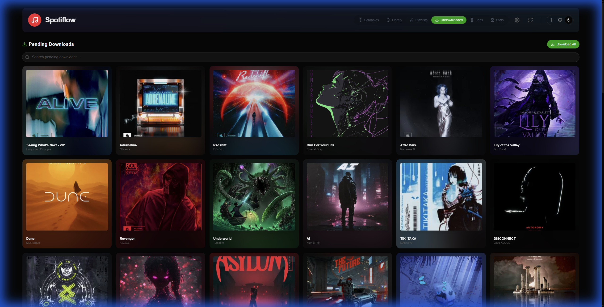
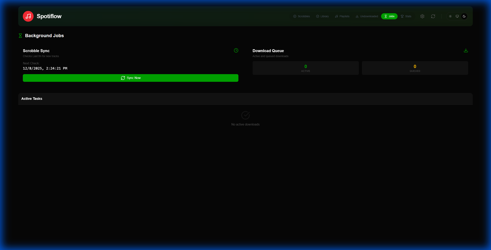

# Spotiflow

A self-hosted application that automatically downloads your recent Last.fm scrobbles as high-quality MP3s, organized perfectly for Plex.



## 🚀 Features

-   **Automatic Background Downloads**: Checks for new scrobbles every 30 minutes (configurable).
-   **Smart Deduplication**: Maintains a local database to prevent re-downloading existing songs.
-   **Plex-Ready Organization**: Automatically sorts files into `Artist/Album/Song.mp3`.
-   **Metadata Injection**: Embeds correct Artist, Title, and Album tags (ignoring messy YouTube titles).
-   **Modern UI**: Beautiful, responsive dashboard built with React, Vite, and Tailwind CSS v4.
-   **Theming**: Fully customizable with Light/Dark modes and multiple color themes (Violet, Blue, Green, Orange, Red, Slate).
-   **Library Management**: View your downloaded collection, search for tracks, and manually trigger downloads.
-   **Undownloaded View**: Quickly see which scrobbles haven't been downloaded yet, search them, and queue them all with one click.
-   **Job Management**: Monitor active and pending downloads in real-time with a dedicated Jobs page.
-   **Advanced Statistics**: Visualize your listening habits with top tracks, activity charts, and more.
-   **Playlists**: Create and manage playlists from your downloaded library.
-   **Interactive Tutorial**: A built-in guide to help you get started and configure your API keys on the first run.
-   **Dockerized**: Easy deployment on local machines or NAS (Synology, Unraid, etc.).

## 📸 Screenshots

### Dashboard
Overview of your recent scrobbles and activity.


### Library
Browse your downloaded collection with album art and metadata.


### Statistics
Deep dive into your listening trends.


### Undownloaded Tracks
See what's missing from your library and download everything with a single click.


### Job Queue
Track the status of your downloads in real-time.


### Settings & Theming
Configure API keys, update intervals, and customize the look and feel of the app.


### First-Run Tutorial
Helpful guide to get you set up quickly.


## 🛠️ Tech Stack

-   **Frontend**: React, Vite, Tailwind CSS v4, Framer Motion, Lucide React
-   **Backend**: Python, FastAPI, APScheduler
-   **Core**: `yt-dlp` (for downloading), `ffmpeg` (for conversion), `mutagen` (for tagging)
-   **Database**: SQLite

## 📦 Installation

### Option 1: Local Development (Docker Compose)

1.  **Clone the repository**:
    ```bash
    git clone https://github.com/Stellanis/Spotify_scrobbler.git
    cd Spotify_scrobbler
    ```

2.  **Configure Environment**:
    Create a `.env` file in `backend/` (or set via Docker env vars):
    ```env
    LASTFM_API_KEY=your_api_key_here
    LASTFM_USER=your_username
    ```

3.  **Run**:
    ```bash
    docker-compose up --build -d
    ```

4.  **Access**:
    -   Frontend: `http://localhost:3001` (or `http://localhost:5173` for dev)
    -   Backend: `http://localhost:8000`

### Option 2: NAS Deployment (Portainer)

This project includes a `docker-compose.nas.yml` optimized for NAS setups.

1.  **Open Portainer** on your NAS.
2.  **Create a new Stack**.
3.  **Repository URL**: `https://github.com/Stellanis/Spotify_scrobbler.git`
4.  **Compose Path**: `docker-compose.nas.yml`
5.  **Environment Variables**:
    -   `LASTFM_API_KEY`: Your Last.fm API Key
    -   `LASTFM_USER`: Your Last.fm Username
6.  **Volume Mapping** (Crucial):
    Ensure the volume mapping in `docker-compose.nas.yml` uses variables or matches your NAS music folder path.
    
    **Environment Variables for Paths**:
    Add these to your Portainer Stack Environment variables:
    -   `HOST_MUSIC_PATH`: The absolute path to your music folder on the NAS (e.g., `/volume1/docker/data/Music`)
    -   `HOST_DATA_PATH`: The absolute path where you want to store app data (e.g., `/volume1/docker/appdata/spotiflow/data`)

7.  **Deploy Stack**.
    *Note: Portainer will build the image from the source code in the repository. This may take a few minutes.*

## 📂 Folder Structure

Downloaded music is organized automatically:

```
/downloads
├── Artist Name
│   └── Album Name
│       └── Song Title.mp3
└── Another Artist
    └── Album Name
        └── Song Title.mp3
```

## 🔧 Configuration

| Variable | Description | Default |
| :--- | :--- | :--- |
| `LASTFM_API_KEY` | **Required**. Get one at [last.fm/api](https://www.last.fm/api) | - |
| `LASTFM_USER` | **Required**. The user to fetch scrobbles for. | - |
| `LASTFM_API_SECRET` | Optional. Not currently used for public reads. | - |
| `SCROBBLE_UPDATE_INTERVAL` | Minutes between checks. | `30` |
| `SCROBBLE_LIMIT_COUNT` | Number of recent tracks to check. | `20` |
| `AUTO_DOWNLOAD` | `true` or `false`. | `true` |

## 🤝 Contributing

Pull requests are welcome! For major changes, please open an issue first to discuss what you would like to change.

## 📄 License

[EUPL-1.2](https://eupl.eu/1.2/en/)