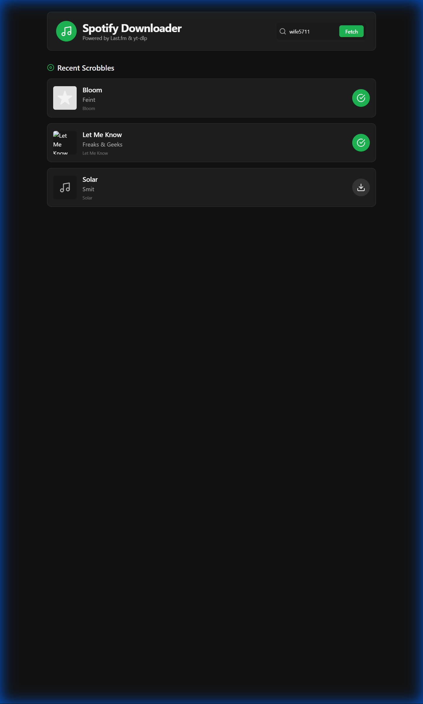

# Spotify Scrobble Downloader

A self-hosted application that automatically downloads your recent Last.fm scrobbles as high-quality MP3s, organized perfectly for Plex.

 
*(Replace with actual screenshot if available)*

## 🚀 Features

-   **Automatic Background Downloads**: Checks for new scrobbles every 30 minutes (last 20 tracks).
-   **Smart Deduplication**: Maintains a local database to prevent re-downloading existing songs.
-   **Plex-Ready Organization**: Automatically sorts files into `Artist/Album/Song.mp3`.
-   **Metadata Injection**: Embeds correct Artist, Title, and Album tags (ignoring messy YouTube titles).
-   **Modern UI**: Beautiful, dark-themed React dashboard to view recent tracks and manual download status.
-   **Dockerized**: Easy deployment on local machines or NAS (Synology, Unraid, etc.).

## 🛠️ Tech Stack

-   **Frontend**: React, Vite, Tailwind CSS, Framer Motion
-   **Backend**: Python, FastAPI, APScheduler
-   **Core**: `yt-dlp` (for downloading), `ffmpeg` (for conversion), `mutagen` (for tagging)
-   **Database**: SQLite

## 📦 Installation

### Option 1: Local Development (Docker Compose)

1.  **Clone the repository**:
    ```bash
    git clone https://github.com/Stellanis/Spotify_scrobbler.git
    cd Spotify_scrobbler
    ```

2.  **Configure Environment**:
    Create a `.env` file in `backend/` (or set via Docker env vars):
    ```env
    LASTFM_API_KEY=your_api_key_here
    LASTFM_USER=your_username
    ```

3.  **Run**:
    ```bash
    docker-compose up --build -d
    ```

4.  **Access**:
    -   Frontend: `http://localhost:3001`
    -   Backend: `http://localhost:8000`

### Option 2: NAS Deployment (Portainer)

This project includes a `docker-compose.nas.yml` optimized for NAS setups.

1.  **Open Portainer** on your NAS.
2.  **Create a new Stack**.
3.  **Repository URL**: `https://github.com/Stellanis/Spotify_scrobbler.git`
4.  **Compose Path**: `docker-compose.nas.yml`
5.  **Environment Variables**:
    -   `LASTFM_API_KEY`: Your Last.fm API Key
    -   `LASTFM_USER`: Your Last.fm Username
6.  **Volume Mapping** (Crucial):
    Ensure the volume mapping in `docker-compose.nas.yml` matches your NAS music folder path:
    ```yaml
    volumes:
      - /volume1/docker/data/Music:/app/downloads
    ```
7.  **Deploy Stack**.

## 📂 Folder Structure

Downloaded music is organized automatically:

```
/downloads
├── Artist Name
│   └── Album Name
│       └── Song Title.mp3
└── Another Artist
    └── Album Name
        └── Song Title.mp3
```

## 🔧 Configuration

| Variable | Description | Default |
| :--- | :--- | :--- |
| `LASTFM_API_KEY` | **Required**. Get one at [last.fm/api](https://www.last.fm/api) | - |
| `LASTFM_USER` | **Required**. The user to fetch scrobbles for. | - |
| `LASTFM_API_SECRET` | Optional. Not currently used for public reads. | - |

## 🤝 Contributing

Pull requests are welcome! For major changes, please open an issue first to discuss what you would like to change.

## 📄 License

[MIT](https://choosealicense.com/licenses/mit/)